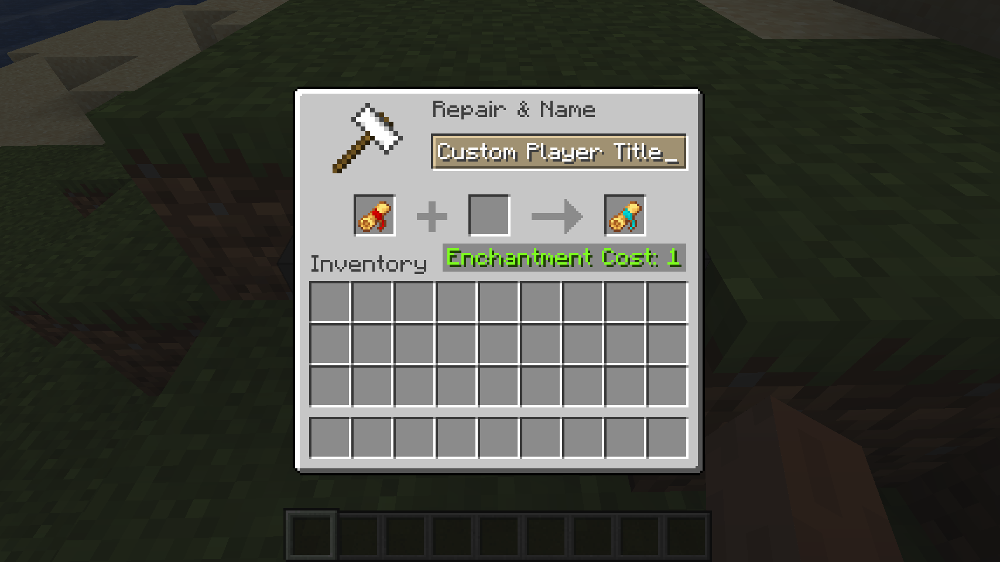
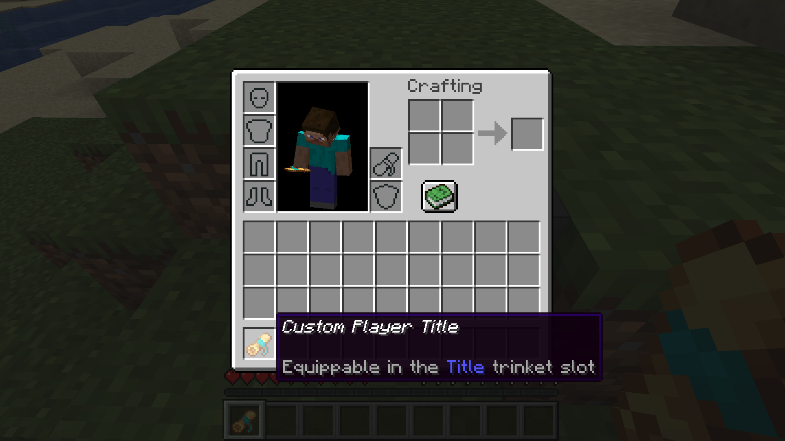
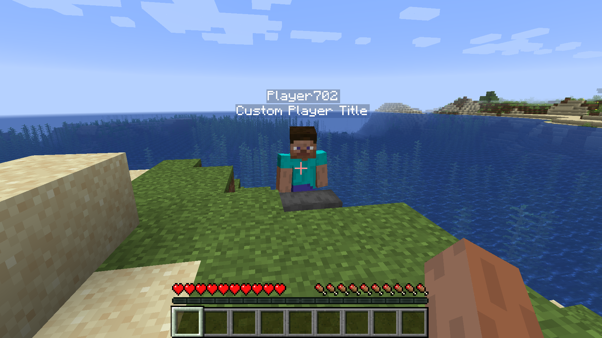
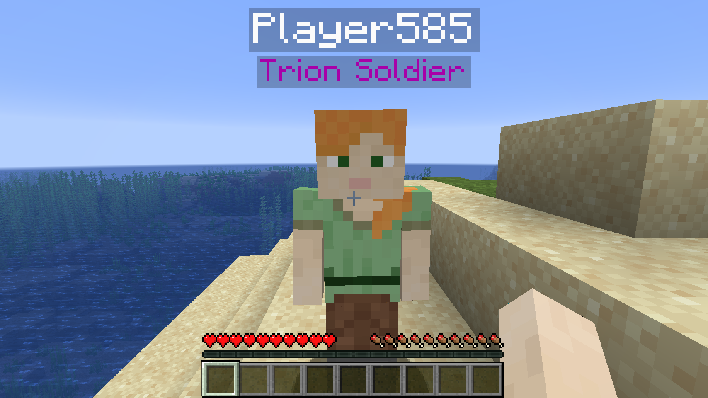

# Title Scrolls
This mod is a near rewrite of [TitleScrolls](https://gitlab.com/repulica/title-scrolls) by [repulica](https://gitlab.com/repulica). Some code from the original was modified to suit the rewrite, so it remains under the original license. All textures are from the original.
## Discription
Title Scrolls adds trinkets that display a title under player names. Common title scrolls can be crafted with two paper and two string and renamed in an anvil to set the title. All Titles are component-based, so adding one is as simple as customizing a give command.
## Gameplay Images




## Modders
As all titles are component-based, adding a title to a mod is as simple as adding a new component to the title scroll item.
```java
public class Demo implements ModInitializer {
    @Override
    public void onInitialize() {
        ItemStack stack = new ItemStack(Items.BASE_TITLE_SCROLL);
        stack.set(ComponentTypes.TITLE_TEXT, TitleTextComponet.of(Text.literal("Early Bird")));
        stack.set(ComponentTypes.SCROLL_LORE, ScrollLoreComponent.of(List.of(Text.literal("The Early Bird catches the worm"))));
        stack.set(ComponentTypes.RIBBON_COLOR, RibbonColorComponent.of(0x00FF00));
        stack.set(ComponentTypes.RENDER_EFFECT, RenderEffectComponent.of(Identifier.of("modid", "demo")));
    }
}
```
Adding a new Effect is as simple as creating a class implementing `titlescrolls.api.TitleEffect` and registering it with the `TitleEffects.INSTANCE#register(Identfier, TitleEffect)`.
```java
public class Demo implements ModInitializer {
    TitleEffect DEMO = new TitleEffect() {
        @Override
        public void render(ItemStack stack, SlotReference slot, MatrixStack matrixStack, 
                           VertexConsumerProvider vertexConsumer, int light,
                           EntityModel<? extends LivingEntity> model, LivingEntity player,
                           float headYaw, float headPitch) {
            //Render your effect here
        }
    };
    @Override
    public void onInitialize() {
        TitleEffects.INSTANCE.register(new Identifier("modid", "demo"), DEMO);
    }
}
```
